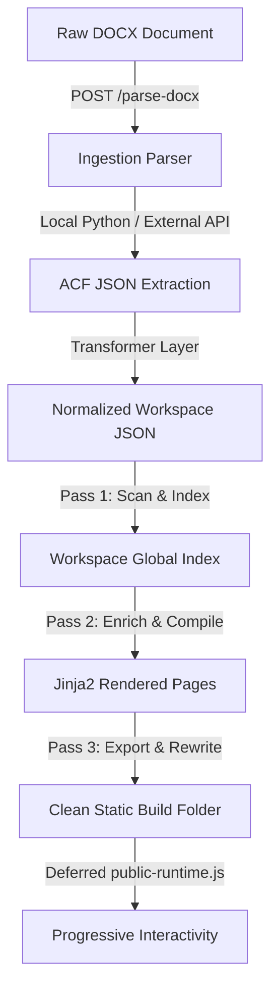

# DegreeBaba Page Builder — System Architecture & Implementation Report

This report serves as the single source of truth for the DegreeBaba Page Builder project. It documents the system overview, architecture, multi-tenant workspace configurations, rendering engine, dynamic lead capture flow, responsive design systems, and the hybrid specialization-to-course mapping system.

---

## 1. Project Overview

**DegreeBaba Page Builder** is a high-performance content ingestion, multi-tenant workspace manager, and static site compilation engine designed for distance and online university portals. 

### Core Highlights:
*   **Multi-Tenant Architecture**: Supports multiple universities (e.g., NMIMS, Chandigarh University) in isolated workspace directories. Each university’s content, theme, logo, contact settings, and build output exist independently.
*   **Workspace-Based System**: Content pages are organized into directories on disk rather than database tables. The workspace directories act as self-contained databases, making version control simple and deployment fast.
*   **JSON-First Content Pipeline**: Microsoft Word (`.docx`) curriculum documents are parsed and translated into structured, schema-validated Advanced Custom Fields (ACF) JSON datasets (`source.json`). These JSON files represent the absolute source of truth for pages.
*   **Static Website Export System**: Generates static, SEO-optimized HTML websites. It automatically rewrites internal links, bundles assets, builds XML sitemaps, and formats routing tables for rapid CDN deployments.

---

## 2. Complete Architecture

The DegreeBaba system processes raw data from MS Word documents to fully compiled, static production pages through the following pipeline:



### Detailed Pipeline Stages:
1.  **Ingestion & Parsing**: Ingests raw `.docx` files. Blog posts and generic articles are parsed locally via a native Python extractor (`parser.py`). Complex academic program files are parsed by forwarding their raw bytes to an external micro-pipeline server (`MICRO_APP_URL`).
2.  **ACF JSON Extraction**: The parser structures text blocks into standardized Advanced Custom Fields (ACF) matching the targeted schema type.
3.  **Transformer Layer**: The system picks the matching page transformer class (e.g., `CourseTransformer`, `SpecializationTransformer`). The transformer normalizes naming fields, cleans currency values, and produces a normalized context dictionary.
4.  **Workspace Persistence**: The output is saved to the workspace's page subfolder as `source.json` (source of truth) and a static `.html` draft.
5.  **Compiler Pass 1 (Index & Scan)**: Scans all `source.json` files in the workspace, compiles an in-memory catalog, and validates required images.
6.  **Compiler Pass 2 (Context Enrichment)**: Resolves relationships (like mapping sibling specializations or parent programs) and compiles the final HTML pages with complete context.
7.  **Export System (Builder)**: Wipes the `build/` directory, optimizes and copies media, bundles static CSS, fonts and JavaScript, and produces routing manifests (`routes.json`) and `sitemap.xml`.

---

## 3. Workspace System

The workspace layout organizes self-contained, university-specific assets and configurations on disk:

```text
workspaces/
└── {university_slug}/                # Directory slug (Internal-only name, e.g., 'nmims-2')
    ├── metadata.json                 # Core settings (theme styling, branding details, compile logs)
    ├── University/
    │   ├── source.json               # Raw transformed ACF JSON
    │   └── university.html           # Compiled home page
    ├── Courses/
    │   └── {course_slug}/
    │       ├── source.json           # Raw program details
    │       └── course.html           # Compiled course page
    ├── Specializations/              # Flat directory layout (not nested)
    │   └── {specialization_slug}/
    │       ├── source.json           # Raw specialization details
    │       └── specialization.html   # Compiled specialization page
    ├── Blogs/
    │   └── {blog_slug}/
    │       ├── source.json
    │       └── blog.html
    ├── Pages/                        # Auto-generated system listing pages
    │   ├── programs/                 # All courses list page
    │   ├── specializations/          # All specializations list page
    │   └── blog/                     # Blog directory page
    ├── Assets/
    │   ├── images/                   # Localized image files (logos, badges, heroes)
    │   └── downloads/                # Syllabus brochures and attachments
    └── build/                        # Compiled production website folder
```

### Workspace Naming Constraint
The name of the workspace directory (e.g., `nmims-2`) is an **internal-only identifier** used for server-side routing and directory mapping. It is **never** shown to the end user. This ensures that internal development iteration names or version duplicates (like `nmims-2`, `test-1`) do not leak into visible headings, titles, or badges. The user-facing UI derives all names from the validated `university_name` parameter defined in the workspace's `metadata.json` or its core `University` source page.

---

## 4. University Branding

Branding elements are shared across all compiled pages in a workspace:

*   **Shared Configurations**: The compiler extracts primary, secondary, and background colors, established years, and contact details (email, address) from `metadata.json` and passes them to the rendering engine.
*   **Branding Uniformity**: Every header, sticky bar, and footer dynamically loads branding configurations.
*   **Automatic Logo Generation**: The system extracts the first letter of the `university_name` (e.g., "N" for "NMIMS") and displays it inside a colored square badge when an image logo is absent.
*   **Branding Isolation (UI Fixes)**: The workspace slugs (e.g., `nmims-2`) are explicitly stripped from UI titles, headers, footers, and badges. They are replaced by the clean `university_name` (e.g., "NMIMS") across all generated templates.

---

## 5. Rendering Engine

The rendering pipeline (`backend/renderer/engine.py`) uses Jinja2 templates to build static structures:

*   **Custom Filters**: Registered custom filters, such as `de` (`default_empty`), handle missing variables safely to prevent template compilation errors.
*   **Syllabus & Admission Parsers**: The engine uses HTML parsers (`SyllabusHTMLParser`, `AdmissionHTMLParser`) to split blocks of text into structured JSON lists. These parsed lists (like sem-by-sem curriculums or step-by-step registration lists) are rendered cleanly as structured components rather than generic HTML blobs.
*   **Static Template Context**: Complex dictionaries such as FAQs, reviews and statistics are normalized in Python and rendered directly by Jinja. The small deferred `public-runtime.js` file only wires progressive interactions such as menus, accordions and tabs.
*   **Centralized Href System**: Link mappings are calculated during the compilation pass. Dynamic tags are translated to clean URL structures matching the route map rules.

---

## 6. Lead Capture Architecture

The lead capture system is completely decoupled from the static page generator to ensure reliability and simplify maintenance.

```text
Static Pages (DegreeBaba Build)
      │
      ▼ [Click CTA Button]
Central Lead Form App (React, Hosted at LEAD_BASE_URL)
      │
      ▼ [Encode payload, read document.referrer]
CRM Webhook (Supabase Edge Function)
```

### 6.1 LEAD_BASE_URL
The environment variable `LEAD_BASE_URL` points to the hosted lead capture React application. All CTA buttons across all course, specialization, and university pages generate URLs targeting this application.

### 6.2 Encoded Payload
To avoid query string manipulation and protect parameters, lead parameters are packed into a single URL-safe Base64 encoded JSON parameter called `d`:

```javascript
// Example Payload Schema:
{
  "uni": "nmims",
  "uni_name": "NMIMS Online",
  "logo_letter": "N",
  "program": "nmims-online-mba",
  "program_name": "NMIMS Online MBA",
  "specialization": "mba-finance",
  "specialization_name": "Finance",
  "source": "brochure",
  "phone": "1800-102-5136"
}
```

The compiled static pages calculate this token during compilation to build target links like `https://applicationquery.vercel.app/form?d=eyJ1bmkiOiJubWltcyIsICJ1bmlfbmFtZSI6Ik5NSU1TIiwgLi4ufQ==`.

### 6.3 Contact Application
The contact application is an independent, single-page React app built with Vite. It has no backend dependencies and handles:
1.  Decoding the URL `d` parameter.
2.  Dynamically branding the interface (loading colors, logos, and course-specific headings).
3.  Displaying context-aware lead forms based on the `source` field (e.g., a "Download Brochure" form versus an "Apply Now" form).
4.  Submitting lead payloads to the CRM.

### 6.4 Referrer Navigation
Instead of passing redirect URLs in the query parameters (which can break or leak internal paths), the contact app captures the browser’s `document.referrer`.
*   During initial page load, the app saves `document.referrer` to `sessionStorage` under the key `"return_url"`.
*   When a user clicks "Back to Website" or completes a form submission, the app redirects them back to the stored `"return_url"`.
*   If `sessionStorage` is empty, the app falls back to `window.history.back()`.

### 6.5 CRM Webhook Integration
The contact application sends leads directly to the Supabase CRM endpoint.
*   **Endpoint**: `https://yepxydikozzrzxbybrxd.supabase.co/functions/v1/webhook-inbound`
*   **Authentication**: Outbound requests require an `X-API-Key` header with the token.
*   **Payload Format**:
    ```json
    {
      "source": "Download Brochure",
      "lead": {
        "full_name": "John Doe",
        "mobile_number": "9876543210",
        "email": "john.doe@example.com",
        "city": "Mumbai",
        "state": "",
        "country": "India",
        "company": "",
        "course": "NMIMS Online MBA",
        "specialization": "Finance",
        "campaign_name": "NMIMS Online",
        "campaign_id": "",
        "adgroup_id": ""
      }
    }
    ```

---

## 7. Contact App Structure

The decoupled contact application resides in the `contact/` folder:

```text
contact/
├── package.json
├── vite.config.js
├── .env                              # VITE_WEBHOOK_URL & VITE_WEBHOOK_API_KEY
├── src/
│   ├── main.jsx                      # App mount entry point
│   ├── App.jsx                       # Form rendering, state manager, validation logic
│   ├── App.css                       # Layout styles
│   ├── utils/
│   │   └── payload.js                # Base64 URL-safe decoder and fallback mapper
│   └── services/
│       └── webhook.js                # Webhook submit handler
```

*   **Responsive Layout**: The app uses Tailwind CSS grid structures, displaying full layouts on desktop and stacked forms on mobile.
*   **Input Validation**: Validates full names, email syntax, and 10-digit mobile numbers client-side before sending data.

---

## 8. CTA System

The CTA system is standardized across all page templates. Every call-to-action button links to the centralized lead app (`LEAD_BASE_URL`) with a custom `source` token:

| CTA Element | Placement | Target Action/Source |
| :--- | :--- | :--- |
| **Apply Now** | Header, Page Bottom | `apply` |
| **Download Brochure** | Hero Section, Sidebar | `brochure` |
| **Enquire Now** | Hero Section, Sticky Bar | `enquiry` |
| **Book Counselling** | Sidebar, Mid-page | `counselling` |
| **Get Fee Structure** | Fees Section | `fees` |
| **WhatsApp Us** | Floating Widget | Redirects directly to the Whatsapp API |
| **Call Helpline** | Admissions Desk | Links directly to the helpline phone numbers |

---

## 9. Image System

To prevent layout shifting (CLS) and ensure visual consistency, the page layouts enforce strict image rendering rules:

*   **Fixed Dimensions & aspect ratios**: Hero banners and degree certificate placeholders are rendered inside containers with explicit aspect ratios (e.g., `aspect-video`, `aspect-[4/3]`).
*   **Object-Fit**: CSS sets `object-fit: cover` and `object-position: center` on all dynamic images. This ensures that uploaded files fit their container without stretching or distorting.
*   **Image Safety & Fallbacks**: The compiler checks for the presence of required images (like `hero_image_url` and `certificate_image_url`) in the `source.json` database. If an image is missing or invalid, compiler execution fails to prevent broken assets in production.

---

## 10. Responsive Design

DegreeBaba uses a responsive design strategy to ensure compatibility across devices:

*   **Grid Layouts**: Layouts use flexible grids (`grid-cols-1 md:grid-cols-3`) that scale from single-column on mobile to three-columns on desktop.
*   **Mobile Navigation**: Displays a simplified layout on mobile. The detailed desktop navigation links are hidden behind a touch-friendly hamburger menu.
*   **Touch Breakpoints**: Common breakpoints include:
    *   `768px`: Hides desktop navigation, shifts grids to double or single columns, and adjusts page footers.
    *   `640px`: Stacks all grid cards vertically into a single column.
*   **Fluid Typography**: Uses relative CSS units (like `rem`, `vh`) for consistent sizing across screens.

---

## 11. Hybrid Course & Specialization System

The hybrid specialization system resolves parent-child relationships between courses and specializations.

### 11.1 Why it was introduced
The previous ingestion pipeline treated specialization fee plans as individual pages. This resulted in duplicate pages and required administrators to maintain multiple lists of specializations manually. The hybrid system decouples these structures: **Courses** represent the primary academic degrees, and **Specializations** are linked to their parent courses via mapping keys.

### 11.2 The Hybrid Pipeline
The data lifecycle for specializations is structured as follows:

```text
ACF Upload
  │
  ▼
Classifier Detection
  │
  ▼
Link parent_slug (Review UI Screen)
  │
  ▼
Compile (Inject contexts)
```

1.  **Detection**: The system scans incoming payloads. If it detects a specialization, it tags the page type.
2.  **Parent Matching Heuristic**: An automatic scoring classifier matches the specialization’s slug to existing workspace courses by comparing shared tokens.
3.  **Manual Assignment**: Administrators can review, assign, or override parent courses in the React Review UI before saving.
4.  **Enrichment**: During compilation, the compiler uses `parent_slug` to fetch the parent course's details and inject them into the specialization page.

### 11.3 Specialization Page Elements
*   **Dynamic Headings**: Specialization headers are dynamically built using the pattern:
    `{{ parent_program_name }} in {{ specialization_name }}`
    *(e.g., "NMIMS Online BBA in Business Analytics" instead of a hardcoded title).*
*   **Breadcrumbs**: Automatically builds navigation paths from `Home` -> `{Parent Course}` -> `{Specialization}`.
*   **Clean Specialization Names**: Specialization titles are normalized automatically during save operations (via `normalize_specialization_name`). This strips redundant degree titles or university prefixes (e.g., "Bba Business Analytics" is cleaned to "Business Analytics").
*   **Sibling Comparison Table**: Specialization pages include a section comparing fees and details of sibling specializations. Sibling entries are rendered as clickable internal links, allowing users to navigate directly between specializations of the same parent course.

---

## 12. Current Features

The current implementation includes the following completed features:

*   [x] **Workspace Separation**: Independent directories, configuration files, and output builds for each tenant.
*   [x] **Ingestion & Micro-Pipeline Integration**: Parses uploaded `.docx` files and transforms them into structured ACF JSON payloads.
*   [x] **Two-Pass Compiler**: Indexes resources, injects relationship contexts, and compiles templates.
*   [x] **Website Exporter**: Builds static files, rewrites dynamic URL anchors, and generates sitemaps and manifests.
*   [x] **Lead Capture React Application**: Centralized, decoupled lead capture forms with Base64 payload decoding.
*   [x] **Referrer-Based Back Navigation**: Stores referrers in session variables to return users to the correct source page.
*   [x] **Supabase CRM webhook**: Sends lead data to the CRM with secure API key authentication.
*   [x] **Hybrid Parent Mapping**: Connects specializations to parent courses with token-matching heuristics and manual overrides.
*   [x] **Clean Specialization Names**: Normalization logic strips redundant titles and prefixes from specialization names.
*   [x] **Unified Specialization Listing**: Renders a continuous three-column grid of specializations with parent course badges.
*   [x] **Responsive Templates**: Adapts layouts to desktop and mobile screens.

---

## 13. Remaining Work

The project roadmap includes the following remaining tasks:

*   **Responsive Refinement**: Review CSS layouts across mobile devices to resolve minor visual issues on intermediate screen sizes.
*   **Contact App Polish**: Add loading states to form inputs and improve validation message design.
*   **Performance Optimization**: Enable caching for parsed files and static compiler steps.
*   **Testing**: Add unit tests for the ingestion pipeline, lead payload decoder, and compiler.

---

## 14. Folder Structure

The project directory is structured as follows:

```text
acfTOhtml-copy/
├── backend/                          # FastAPI Backend Application
│   ├── core/                         # Routing engines and utilities
│   ├── ingestion/                    # .docx parsing and JSON extraction
│   ├── renderer/                     # Jinja2 rendering engine
│   ├── workspace/                    # Workspace manager and compiler
│   ├── templates/                    # Jinja2 template files
│   ├── workspaces/                   # University workspace storage
│   └── main.py                       # Application API definitions
├── frontend/                         # Admin Management Portal (React)
│   ├── src/
│   │   ├── components/               # UI screens (Review, Preview, Workspace)
│   │   └── App.jsx                   # React root component
├── contact/                          # Central Lead Capture Application (React)
│   └── src/
│       ├── utils/                    # Base64 payload decoder
│       └── App.jsx                   # Lead forms and webhook integration
```

---

## 15. Environment Variables

The system uses the following environment variables:

### Backend (`backend/.env`)
*   `MICRO_APP_URL`: The URL of the external parsing service used for university and course documents.
*   `LEAD_BASE_URL`: The URL of the hosted lead capture application.

### Contact Application (`contact/.env`)
*   `VITE_WEBHOOK_URL`: The inbound Supabase CRM webhook endpoint.
*   `VITE_WEBHOOK_API_KEY`: The API key header used to authenticate calls to the CRM.

---

## 16. Validation

The following checks are executed during workspace compilation and static site generation:

1.  **Image Validation**: Checks that heroes and certificate images exist in the workspace before compiling.
2.  **Link Verification**: Verifies that parent courses and sibling specializations exist in the index to prevent broken links.
3.  **Collision Checks**: Ensures that course and specialization slugs do not collide with system-reserved paths like `/programs/` or `/blog/`.
4.  **Payload Decoding Verification**: Confirms that lead capture URL parameters decode into valid JSON objects.
5.  **UI Content Safety Check**: Verifies that phone numbers, personal email addresses, or admin logins are absent from production builds.

---

## 17. Known Limitations

*   **No Real-time CRM Sync**: Lead data is sent directly to the CRM, but updates inside the CRM are not synced back to the page builder workspace.
*   **Static Page Rebuild Requirement**: Modifying a page’s content requires recompiling the workspace to update sitemaps, manifests, and listing pages.

---

## 18. Future Roadmap

### Short-Term
*   Add automated integration tests for the workspace compiler and builder.
*   Optimize compiler speeds by caching unchanged static pages on disk.

### Medium-Term
*   Add real-time workspace compilation status tracking to the React admin dashboard.
*   Integrate direct asset uploads (like images and brochures) from local devices into the Review screen.

### Long-Term
*   Support publishing static assets directly to cloud storage (such as AWS S3 or Cloudflare Pages) from the build interface.
*   Build a global search index across course pages in the static workspace files.
