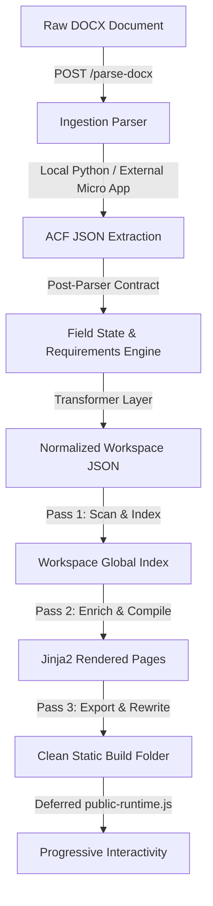

# DegreeBaba Page Builder — System Architecture & Implementation Report

This report serves as the single source of truth for the DegreeBaba Page Builder project. It documents the system overview, complete pipeline architecture, post-parser field contracts, multi-tenant workspace configurations, rendering engine, draft management, decoupled lead capture flow, responsive design systems, and the hybrid specialization-to-course mapping system.

---

## 1. Project Overview

**DegreeBaba Page Builder** is an enterprise-grade content ingestion, multi-tenant workspace manager, and static site compilation engine designed for distance and online university portals. 

### Core Highlights:
*   **Multi-Tenant Architecture**: Supports multiple universities (e.g., NMIMS, IGNOU, Chandigarh University) in isolated workspace directories. Each university’s content, theme, logo, contact settings, and build output exist independently.
*   **Workspace-Based System**: Content pages are organized into filesystem directories on disk rather than traditional relational database tables. The workspace directories act as self-contained databases (`source.json`), making version control simple and static deployment fast.
*   **JSON-First Content Pipeline**: Microsoft Word (`.docx`) curriculum documents are parsed and translated into structured, schema-validated Advanced Custom Fields (ACF) JSON datasets (`source.json`). These JSON files represent the absolute source of truth for pages.
*   **Post-Parser Field Contract**: Implements a canonical field ownership model (`backend/core/field_definitions.py`) classifying every field as `AUTO`, `MANUAL`, `DERIVED`, or `optional`, accompanied by formal validation rules (`backend/core/page_requirements.py`).
*   **Drafts Subsystem**: Allows non-destructive draft creation, auto-saving, draft resumption, and one-click publishing before pages are committed to workspace storage.
*   **Static Website Export System**: Generates static, SEO-optimized HTML websites. It automatically rewrites internal links, bundles assets, builds XML sitemaps, and formats routing tables for rapid CDN deployments.

---

## 2. Complete Architecture

The DegreeBaba system processes raw data from MS Word documents to fully compiled, static production pages through the following pipeline:



### Detailed Pipeline Stages:
1.  **Ingestion & Parsing**: Ingests raw `.docx` files or ACF JSON text. Blog posts and generic articles are parsed locally via a native Python extractor (`ingestion/parser.py`). Complex academic program files are parsed by forwarding raw bytes to an external micro-pipeline server (`MICRO_APP_URL`).
2.  **ACF JSON Extraction**: The parser structures text blocks into standardized Advanced Custom Fields (ACF) matching the targeted schema type.
3.  **Post-Parser Contract & Field State**: `core/field_definitions.py` and `core/page_requirements.py` compute `field_state` metadata (ownership type, missing state, requirement status) without mutating parsed field values.
4.  **Transformer Layer**: The system picks the matching page transformer class (`CourseTransformer`, `SpecializationTransformer`, `UniversityTransformer`, `BlogTransformer`). The transformer normalizes naming fields, formats currency values (`format_fee`), and produces a normalized context dictionary.
5.  **Workspace Persistence**: The output is saved to the workspace's page subfolder as `source.json` (source of truth) and a static `.html` draft.
6.  **Compiler Pass 1 (Index & Scan)**: Scans all `source.json` files in the workspace, compiles an in-memory catalog, and validates required assets.
7.  **Compiler Pass 2 (Context Enrichment)**: Resolves relationships (like mapping sibling specializations or parent programs) and compiles the final HTML pages with complete context.
8.  **Export System (Builder)**: Wipes the `build/` directory, optimizes and copies media, bundles static CSS, fonts, and JavaScript, and produces routing manifests (`routes.json`) and `sitemap.xml`.

---

## 3. Workspace & Draft Management

### 3.1 Workspace Directory Layout
The workspace layout organizes self-contained, university-specific assets and configurations on disk:

```text
workspaces/
└── {university_slug}/                # Directory slug (Internal-only name, e.g., 'nmims-2')
    ├── metadata.json                 # Core settings (theme styling, branding details, compile logs)
    ├── University/
    │   ├── source.json               # Raw transformed ACF JSON
    │   └── university.html           # Compiled home page
    ├── Courses/
    │   └── {course_slug}/
    │       ├── source.json           # Raw program details
    │       └── course.html           # Compiled course page
    ├── Specializations/              # Flat directory layout (not nested under Courses/)
    │   └── {specialization_slug}/
    │       ├── source.json           # Raw specialization details
    │       └── specialization.html   # Compiled specialization page
    ├── Blogs/
    │   └── {blog_slug}/
    │       ├── source.json
    │       └── blog.html
    ├── Pages/                        # Auto-generated system listing pages
    │   ├── programs/                 # All courses list page
    │   ├── specializations/          # All specializations list page
    │   └── blog/                     # Blog directory page
    ├── Assets/
    │   ├── images/                   # Localized image files (logos, badges, heroes)
    │   └── downloads/                # Syllabus brochures and attachments
    └── build/                        # Compiled production static website export
```

### 3.2 Workspace Naming Constraint
The directory slug (e.g., `nmims-2`) is an **internal-only identifier** used for filesystem routing. It is **never** shown in user-facing headers, footers, titles, or badges. The user-facing UI derives all names from the validated `university_name` parameter defined in `metadata.json` or the `University` source page.

### 3.3 Drafts Subsystem
The backend and admin UI provide full draft workflow management:
- **Endpoints**: `GET /workspaces/{slug}/drafts`, `GET /workspaces/{slug}/drafts/{type}/{page_slug}`, `POST /drafts`, `DELETE /workspaces/{slug}/drafts/{type}/{page_slug}`, `POST /workspaces/{slug}/drafts/{type}/{page_slug}/publish`.
- **Workflow**: Drafts allow content creators to edit ACF fields, upload images, and review page health without writing directly to production page directories until ready to publish.

---

## 4. Post-Parser Field Contracts & Requirements Engine

The project enforces a strict 3-layer architecture for field management:

1.  **Field Ownership (`backend/core/field_definitions.py`)**:
    -   `AUTO`: Parser-supplied fields (e.g., `program_name`, `duration`, `syllabus_content`).
    -   `MANUAL`: Editor-owned fields (e.g., `hero_image_url`, `reviews`, `certificate_image_url`).
    -   `DERIVED`: System-derived fields produced by identity logic (`slug`, `page_type`, `university_slug`, `parent_slug`).
    -   `optional`: Fields that may remain empty without blocking page rendering.
2.  **Page Requirements (`backend/core/page_requirements.py`)**:
    -   Defines explicit requirement rules and validation specs for University, Course, Specialization, and Blog pages.
3.  **UI Health Panel Integration (`FieldHealthPanel.jsx`)**:
    -   Calculates page completion score (`% filled`).
    -   Highlights missing required fields and optional hidden sections.
    -   Image fields (`*_image_url`, `logo`, `favicon`) are handled in the dedicated Images tab and excluded from health check lists.

---

## 5. University Branding

Branding elements are shared across all compiled pages in a workspace:

*   **Shared Configurations**: The compiler extracts primary, secondary, and background colors, established years, and contact details (email, address) from `metadata.json` and passes them to the rendering engine.
*   **Branding Uniformity**: Every header, sticky bar, and footer dynamically loads branding configurations.
*   **Automatic Logo Generation**: The system extracts the first letter of the `university_name` (e.g., "N" for "NMIMS") and displays it inside a colored square badge when an image logo is absent.
*   **Branding Isolation**: Internal workspace slugs (e.g., `nmims-2`) are explicitly stripped from UI titles, headers, footers, and badges, replaced by the clean `university_name`.

---

## 6. Rendering Engine

The rendering pipeline (`backend/renderer/engine.py`) uses Jinja2 templates to build static structures:

*   **Custom Filters**: Registered custom filters, such as `de` (`default_empty`), handle missing variables safely to prevent template compilation errors.
*   **Syllabus & Admission Parsers**: HTML parsers (`SyllabusHTMLParser`, `AdmissionHTMLParser`) split blocks of text into structured JSON lists for sem-by-sem curriculums or step-by-step registration lists.
*   **Static Template Context**: FAQs, reviews, and statistics are normalized in Python and rendered directly by Jinja. The deferred `public-runtime.js` script handles progressive interactions (menus, accordions, tabs).
*   **SEO & Structured Data**: Automatically injects OpenGraph tags, canonical tags, and JSON-LD schema objects (`EducationalOrganization`, `Course`, `BlogPosting`).

---

## 7. Decoupled Lead Capture System

The lead capture system is completely decoupled from the static page generator to ensure reliability and simplify maintenance.

```text
Static Pages (DegreeBaba Build)
      │
      ▼ [Click CTA Button]
Central Lead Form App (React, Hosted at LEAD_BASE_URL)
      │
      ▼ [Encode payload, read document.referrer]
CRM Webhook (Supabase Edge Function)
```

### 7.1 Encoded Payload (`d` parameter)
To avoid query string manipulation and protect parameters, lead parameters are packed into a single URL-safe Base64 encoded JSON parameter called `d`:

```javascript
{
  "uni": "nmims",
  "uni_name": "NMIMS Online",
  "logo_letter": "N",
  "program": "nmims-online-mba",
  "program_name": "NMIMS Online MBA",
  "specialization": "mba-finance",
  "specialization_name": "Finance",
  "source": "brochure",
  "phone": "1800-102-5136"
}
```

### 7.2 Contact Application (`contact/`)
An independent, single-page React app built with Vite. It decodes `d`, dynamically brands the UI, validates inputs, and submits leads to Supabase.
-   **Webhook Endpoint**: `https://yepxydikozzrzxbybrxd.supabase.co/functions/v1/webhook-inbound`
-   **Referrer Return**: Uses `document.referrer` and `sessionStorage` (`return_url`) to send users back to their exact source page.

---

## 8. Hybrid Course & Specialization System

### 8.1 Concept & Architecture
Decouples specialization pages from duplicate parent program entries. **Courses** represent main academic degrees, while **Specializations** live in a flat `Specializations/<slug>/` filesystem layout linked via `parent_slug`.

### 8.2 Token-Matching Heuristic & Assignment
1.  **Classifier**: Scans incoming specialization title tokens against workspace courses.
2.  **Manual Override**: Administrators can set or change `parent_slug` in the React admin review screen.
3.  **Compiler Pass 2 Enrichment**: During compilation, `parent_slug` is used to fetch the parent course's context and inject sibling specializations for side-by-side comparison tables and breadcrumb links.

---

## 9. Admin UI System (React Frontend)

The `frontend/` single-page admin portal provides a 4-step wizard:

1.  **Screen 0 (Workspace Dashboard)**:
    -   VS Code-style Explorer tree for University, Courses, Specializations, Blogs, and Listing pages.
    -   Real-time search bar & page type filter.
    -   Existing Workspaces card grid featuring university logos/fallback badges, active indicator dots, and workspace slug details.
    -   Sticky Create Workspace panel, Build Status indicators, Branding & SEO accordion, Danger Zone workspace deletion modal, and floating toast notifications.
2.  **Screen 1 (Upload & Ingestion)**:
    -   Dual tab interface for DOCX file upload or ACF JSON pasting.
    -   Explicit page type selection buttons (no default page type, auto-detect toggle removed).
3.  **Screen 2 (Review & Edit)**:
    -   Page Health Panel showing field completion score and missing required/optional field alerts (excluding image fields).
    -   Tabbed editor for text fields and image uploads.
    -   Custom field modal (`AddFieldModal`).
4.  **Screen 3 (Live Preview & Save)**:
    -   Interactive iframe preview of draft HTML page with one-click workspace save & compilation trigger.

---

## 10. Completed Features & Test Suite

### 10.1 Implemented Features
*   [x] **Workspace Separation**: Independent directories, configuration files, and build outputs per university.
*   [x] **Post-Parser Field Contract**: Formal field ownership (`AUTO`, `MANUAL`, `DERIVED`, `optional`) and `build_field_state()`.
*   [x] **Page Requirements System**: Formal requirements definitions for University, Course, Specialization, and Blog pages.
*   [x] **Drafts Subsystem**: Full REST API for list, read, save, delete, and publish drafts.
*   [x] **VS Code-Style Workspace Explorer**: Interactive page tree with search and page type filtering.
*   [x] **Ingestion & Micro-Pipeline Integration**: Local Python DOCX parser + external microservice integration.
*   [x] **Two-Pass Compiler**: Global indexing, relationship resolution, and JINJA2 compilation.
*   [x] **Website Exporter**: Wipes `build/`, copies assets, rewrites internal links, and generates `routes.json` and `sitemap.xml`.
*   [x] **Decoupled Lead Capture App**: Base64 payload decoding, Supabase CRM webhook integration, and referrer return navigation.
*   [x] **Hybrid Parent Mapping**: Token-matching heuristic + manual parent override.
*   [x] **Comprehensive Test Suite**: Automated unit tests for field definitions, page requirements, post-parser pipeline, and transformers.

### 10.2 Automated Unit Test Coverage
- `backend/tests/test_field_definitions.py`: Verifies canonical field ownership classification and missing field detection.
- `backend/tests/test_page_requirements.py`: Verifies requirement specs across all 4 page types.
- `backend/tests/test_post_parser_pipeline.py`: Verifies end-to-end ingestion and contract attachment.
- `backend/tests/test_spec.py`: Verifies specialization normalization and transformer output.

---

## 11. Project Directory Structure

```text
acfTOhtml-copy/
├── .agent/                           # AI Project Memory System
│   ├── AGENTS.md                     # Core rules & architectural facts
│   ├── ARCHITECTURE.md               # System diagrams & technical specifications
│   ├── RULES.md                      # Permanent project constraints
│   ├── ROADMAP.md                    # Progress roadmap & milestone tracking
│   ├── memory/                       # Active state, decisions, regressions, history
│   ├── systems/                      # Subsystem documentation (parser, renderer, editor, etc.)
│   └── tasks/                        # Current sprint & backlog items
├── backend/                          # FastAPI Backend Application
│   ├── core/                         # Core router, field definitions, page requirements, utils
│   │   ├── field_definitions.py      # Canonical field ownership & field-state generator
│   │   ├── page_requirements.py      # Page field validation & requirement rules
│   │   ├── router.py                 # page_type → transformer mapper
│   │   └── utils.py                  # Fee formatting, spec name normalization
│   ├── ingestion/                    # .docx parser, block extractor, adapter
│   ├── renderer/                     # Jinja2 engine, SEO injector, custom filters
│   ├── transformers/                 # Page-specific transformer classes
│   ├── workspace/                    # Workspace manager, compiler, builder, knowledge base
│   ├── templates/                    # Jinja2 HTML templates for 7 page types
│   ├── workspaces/                   # On-disk university workspace databases
│   ├── tests/                        # Pytest unit test suite
│   └── main.py                       # FastAPI application & REST route definitions
├── frontend/                         # React Admin Management Portal
│   ├── src/
│   │   ├── components/               # Screen0Workspace, Screen1Upload, Screen2Review, Screen3Preview, FieldHealthPanel, AddFieldModal
│   │   ├── api.js                    # FastAPI client & draft API stubs
│   │   ├── fieldSchema.js            # Legacy UI schema & diffFields (with image filter)
│   │   └── App.jsx                   # Wizard state manager & step navigation
└── contact/                          # Decoupled Lead Capture Application (React + Vite)
    └── src/
        ├── utils/                    # Base64 URL-safe payload decoder
        ├── services/                 # Supabase CRM webhook client
        └── App.jsx                   # Lead form UI & referrer back navigation
```

---

## 12. Environment Variables

### Backend (`backend/.env`)
*   `MICRO_APP_URL`: External DOCX parsing microservice URL (e.g., `https://micro-app-57l9.onrender.com`).
*   `LEAD_BASE_URL`: Hosted lead capture React app URL (e.g., `https://applicationquery.vercel.app`).

### Contact Application (`contact/.env`)
*   `VITE_WEBHOOK_URL`: Inbound Supabase CRM webhook endpoint.
*   `VITE_WEBHOOK_API_KEY`: API key header used to authenticate calls to the CRM.
