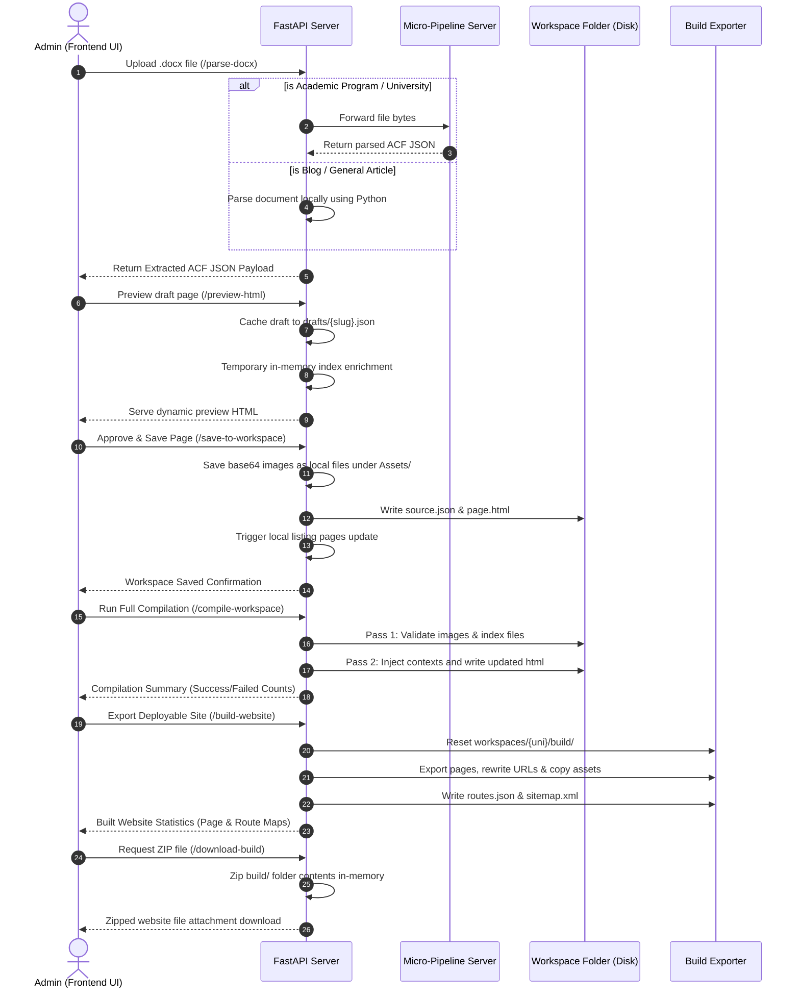

# Page-Engine — Architecture & System Report

This report documents the current system architecture, components, compilation/build workflows, and active APIs of the `page-engine` backend application. It is based directly on the active Python codebase and filesystem structure.

---

## 1. What This Project Does

The `page-engine` project is a high-performance content ingestion, workspace compilation, and static site generation system. It allows university administrators to author comprehensive academic program pages, blog articles, FAQs, and reviews in standard Microsoft Word (`.docx`) files. 

The application:
1. **Parses & Extracts**: Ingests `.docx` files, processes them (either locally or via an external micro-pipeline) into structured Advanced Custom Fields (ACF) JSON databases.
2. **Organizes via Workspaces**: Groups and stores raw ACF payloads (`source.json`) and compiled HTML templates inside separate, version-controlled workspace folders on disk.
3. **Compiles & Enriches**: Runs a **two-pass compiler** to index pages, validate assets, and enrich page data with complex parent-sibling relationship structures (e.g., nesting sibling specializations under courses, loading global university badges).
4. **Static Export**: Generates fully deployable, static website packages ready for production, rewriting URLs, copying assets, and auto-producing XML sitemaps and route manifests.

---

## 2. On-Disk Workspace Layout

Workspaces are maintained on-disk inside the `workspaces/` directory alongside the application source. Each university workspace represents a self-contained filesystem-based repository.

Managed by [manager.py](file:///Users/aryankinha/Documents/Degree/temp/acfTOhtml%20copy/backend/workspace/manager.py), the structure is organized as follows:

```text
workspaces/
└── {university_slug}/
    ├── metadata.json                 # Global configuration (theme colors, contact info, compiling times)
    ├── University/
    │   ├── source.json               # Raw transformed ACF JSON (source of truth)
    │   └── university.html           # Compiled home/landing page
    ├── Courses/
    │   └── {course_slug}/
    │       ├── source.json           # Raw course ACF JSON
    │       └── course.html           # Compiled course detail page
    ├── Specializations/              # Flat organization (not nested inside Course folder)
    │   └── {spec_slug}/
    │       ├── source.json           # Raw specialization ACF JSON
    │       └── specialization.html   # Compiled specialization detail page
    ├── Blogs/
    │   └── {blog_slug}/
    │       ├── source.json           # Raw blog ACF JSON
    │       └── blog.html             # Compiled blog article page
    ├── Pages/                        # Auto-generated system listing pages
    │   ├── programs/
    │   │   ├── source.json           # Listing stub config
    │   │   └── programs_listing.html # Compiled courses listing page
    │   ├── specializations/
    │   │   ├── source.json
    │   │   └── specializations_listing.html
    │   └── blog/
    │       ├── source.json
    │       └── blog_listing.html
    ├── Assets/
    │   ├── images/                   # Localized image assets (logos, certificate images, heroes)
    │   └── downloads/                # Attachable document downloads
    └── build/                        # Output folder generated by the exporter (Pass 4)
```

---

## 3. Ingestion & In-Memory Transformation Pipeline

The ingestion pipeline handles raw document ingestion in two ways inside [main.py](file:///Users/aryankinha/Documents/Degree/temp/acfTOhtml%20copy/backend/main.py):

*   **Local Python Ingestion**: If the page is classified as a blog or generic document, the system extracts the text directly using the local parser in [parser.py](file:///Users/aryankinha/Documents/Degree/temp/acfTOhtml%20copy/backend/ingestion/parser.py), evaluates reading times, maps relevant tags (Finance, Career, Admissions, Student Life) based on text heuristics, and returns the payload in-memory.
*   **External Micro-Pipeline Ingestion**: If it is a university, course, or specialization page, the file is forwarded over multipart/form-data to the external parsing service designated by the `MICRO_APP_URL` environment variable.

---

## 4. The Two-Pass Workspace Compiler

The workspace compiler, implemented in [compiler.py](file:///Users/aryankinha/Documents/Degree/temp/acfTOhtml%20copy/backend/workspace/compiler.py), parses and updates all workspace pages dynamically using a two-pass pipeline:

### Pass 1: Global Index & Validation
1. Recursively scans the workspace directory, loading all `source.json` files.
2. Builds an in-memory global map of the university contents: courses, specializations, blogs, and list stubs.
3. Performs image presence validation. It enforces that required images are present in the page data:
    *   **University**: `hero_image_url`
    *   **Course**: `hero_image_url` and `certificate_image_url`
    *   **Specialization**: `hero_image_url`
    *   **Blog**: `hero_image_url`

### Pass 2: Context Enrichment & Template Compilation
Using the global index, the compiler injects cross-page data context and resolved links into each page's raw data namespace:
*   **University Homepage**: Injects `_workspace_courses`, `_workspace_specs`, and `_workspace_blogs`.
*   **Course Detail Pages**: Injects child specializations `_workspace_specs` (filtering by parent-slug match) and latest `_workspace_blogs`.
*   **Specialization Detail Pages**: Injects parent course descriptor `_workspace_parent` and sibling specialization list `_workspace_sibling_specs` (excluding the current page).
*   **Listing Pages**: Injects corresponding lists to fully populate course, specialization, and article grids.

Finally, the Jinga2 templates are rendered, and compiled HTML files are written directly into their respective folders.

---

## 5. The Website Export Builder (Pass 4)

The website exporter, located in [builder.py](file:///Users/aryankinha/Documents/Degree/temp/acfTOhtml%20copy/backend/workspace/builder.py), turns a compiled university workspace into a standalone, deployable static site. It builds a directory structure under `workspaces/{university_slug}/build/`.

### Export Pipeline Steps:
1.  **Index & Validation Check**: Performs final sanity checks to ensure a university homepage exists, images are present on disk, and parent-child slugs do not contain dangling pointers.
2.  **Route Map Generation & Collision Detection**: Maps keys to path templates. Prevents path conflicts by throwing error logs if course or specialization slugs collide with reserved listing routes (`/programs`, `/specializations`, `/blog`) or duplicate each other.
3.  **Reset Export Target**: Wipes and rebuilds the `build/` output directory.
4.  **Static Page Exporting**: Copies and saves each compiled page to `index.html` inside subfolders (e.g. `/online-mba/index.html`), maintaining clean URL routing.
5.  **URL Link Rewriting**: Rewrites all local links in the raw HTML files:
    *   Replaces dynamic link strings (e.g., `{slug}.dc.html`, `{slug}.html`, `programs_listing.html`) with root-absolute routes (e.g. `/`, `/{slug}/`, `/programs/`).
    *   Replaces dynamic javascript slug strings (like card click links) to generate clean URLs.
    *   Points `./support.js` to `/assets/support.js`.
6.  **Assets Copying**: Migrates all image and download files from the workspace's `Assets/` folders to `/assets/images/` and `/assets/downloads/` in the build target, and saves the central runtime script to `/assets/support.js`.
7.  **Sitemap & Manifest Generation**:
    *   Generates a route map dictionary inside `routes.json` mapping routes to page types.
    *   Creates a compliant `sitemap.xml` containing absolute/relative locations, prioritization, and correct `lastmod` dates pulled from page update parameters.

---

## 6. Jinja2 Rendering Engine

The template compiler engine, located in [engine.py](file:///Users/aryankinha/Documents/Degree/temp/acfTOhtml%20copy/backend/renderer/engine.py), manages template loaders:

*   **Template Loader Configuration**: Loads templates from `templates/` with HTML autoescape enabled. Uses a custom filter `de` (`default_empty`) to safely map `None` references to empty strings `""` to prevent template errors.
*   **Structured Block Parsers**: Employs built-in HTML parsers (`SyllabusHTMLParser`, `AdmissionHTMLParser`) to extract raw HTML content into structured JSON lists for rendering.
*   **JSON Script Pre-Serialization**: Pre-compiles complex page components (syllabus arrays, highlights, fees, FAQ items, recruiter list) into JSON strings (e.g., `faq_data_json`, `y1_json`) inside the Jinja2 context namespace so that scripts can initialize their state without client-side parsing delay.
*   **Centralized Hrefs**: Centralizes navigation links, listing hooks, and tracking/apply links (`build_lead_url`) using the university slug and UTM source tags.

---

## 7. API Reference Matrix

The FastAPI application declared in [main.py](file:///Users/aryankinha/Documents/Degree/temp/acfTOhtml%20copy/backend/main.py) hosts exactly **18 endpoints** orchestrating the pipeline:

| Method | Path | Input Parameters / Payload Model | Return Type | Description |
| :--- | :--- | :--- | :--- | :--- |
| **GET** | `/assets/images/{filename}` | Path parameter: `filename` (string) | `FileResponse` | Serves local images stored in the workspaces' `Assets/images/` folder. |
| **GET** | `/assets/{path:path}` | Path parameter: `path` (string) | `FileResponse` | Serves compiled static assets from the `build/assets/` directory. Falls back to serving `/support.js` if the request matches. |
| **GET** | `/support.js` | None | `FileResponse` | Serves the central javascript support runtime script (`support.js`) from active filesystem paths. |
| **POST** | `/save-temp-json` | JSON: `SaveTempRequest` (`data: dict`) | `JSONResponse` | Persists a temporary debug payload file directly to `backend/generated/temp_debug.json` for inspect/development purposes. |
| **POST** | `/ingest-acf` | JSON: `IngestRequest` (`acf_data: dict`) | `JSONResponse` | Ingests raw ACF JSON, triggers in-memory translation via the matching transformer, and returns the constructed dictionary template context. |
| **POST** | `/preview-html` | JSON: `RenderRequest` (`acf_data`, `images`) | `HTMLResponse` | Renders a page dynamically. Saves a draft record to `backend/generated/drafts/`, enriches it using local workspace content in-memory, and yields compiled HTML. |
| **GET** | `/preview-file` | Query params: `university_slug`, `page_type`, `slug` | `HTMLResponse` | Serves dynamic preview pages. Uses draft cache if available on disk, falling back to compiled index-saved data. |
| **POST** | `/render-html` | JSON: `RenderRequest` (`acf_data`, `images`) | `Response` | Renders pages, saves output under `backend/generated/{page_type}/{slug}.dc.html`, and prompts a browser file attachment download. |
| **POST** | `/parse-docx` | Form: `file: UploadFile`, `page_type: str \| None` | `JSONResponse` | Ingests a `.docx` document. Parses blog/generic files locally, and forwards academic pages to the micro-pipeline parsing server. |
| **POST** | `/workspaces` | JSON: `CreateWorkspaceRequest` (`university_slug`, `university_name`, `metadata_overrides`) | `JSONResponse` | Generates a new workspace folder structure and initializes three listing stub configurations on disk. |
| **POST** | `/save-to-workspace` | JSON: `SaveToWorkspaceRequest` (`acf_data`, `images`, `metadata_overrides`) | `JSONResponse` | Validates required images, saves base64 image strings to localized workspace folders, transforms and renders the page, writes `source.json` and `.html` files, and re-renders listing pages. |
| **POST** | `/compile-workspace` | Form-data: `university_slug` (string) | `JSONResponse` | Runs the full two-pass compiler across the specified workspace, validating assets, and updates `last_compiled_at` timestamps. |
| **GET** | `/workspace-tree` | Query param: `university_slug` (string) | `JSONResponse` | Returns a nested structural tree detailing workspace pages, metadata settings, and status flags. |
| **GET** | `/workspaces` | None | `JSONResponse` | Scans the workspaces root directory on disk and returns status summaries for all registered workspaces. |
| **POST** | `/build-website` | Form-data: `university_slug`, `skip_compile` (bool) | `JSONResponse` | Compiles the workspace (unless skipped) and generates the static website package in `build/`, returning status counts. |
| **GET** | `/build-status` | Query param: `university_slug` (string) | `JSONResponse` | Returns website build statistics (exists flag, route counts, compiled page totals) without triggering a rebuild. |
| **GET** | `/build-file` | Query params: `university_slug`, `path` | `HTMLResponse` / `FileResponse` | Serves a single file from the target `build/` folder. For HTML files, injects a click-interceptor script to allow built-site in-preview navigation. |
| **GET** | `/download-build` | Query param: `university_slug` (string) | `Response` | Packages the entire website build directory into a ZIP archive and triggers a browser download. |

---

## 8. Typical User & Data Lifecycle Workflow

Below is the workflow showing how user inputs progress from document ingest to static site packages:


